# Mermaid diagrams of the generalisations
## care activities bundle
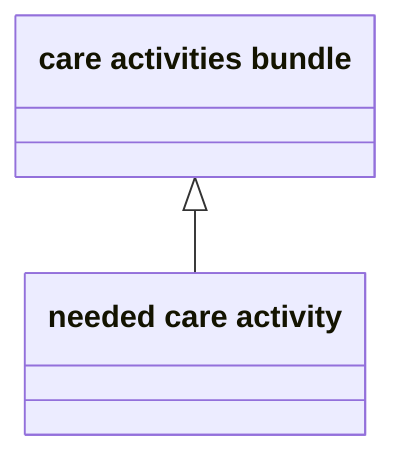
## care activity
```mermaid
classDiagram
    direction BT
    class 9db96600-9f5a-4eed-b7e0-a2fa180bdd9d ["care activity"]
    
    class dc07fff5-a43b-4864-b6e0-09c653fe0385 ["adverse event management"]
    
    class fd2c26ed-422f-41e1-aab0-0192d550e443 ["care activity management"]
    
    class 09eb0a5d-e7e0-4888-8f2b-815bf3217441 ["care assessment"]
    
    class b9488049-fb10-46ff-9eb9-bd6ad482ec76 ["care needs assessment"]
    
    class d58d7cfd-6f75-4a35-a858-7ac8a31b71b6 ["health condition assessment"]
    
    class 1453dfd5-bac0-48ba-a3d7-02c0a4b47b50 ["care communication"]
    
    class c00fde7b-fd40-4b8a-9a33-c68501ac2e97 ["care documenting"]
    
    class 8c73e77f-5318-4136-b648-3a6164c96458 ["care evaluation"]
    
    class cdbed706-d908-4659-a8ef-6337d54cdac3 ["care process evaluation"]
    
    class d0b62045-00cd-4d13-b27f-36963ea9d6c2 ["care investigation"]
    
    class d7644066-60da-4da8-9035-58238dd23ee0 ["care planning"]
    
    class b4841bcb-0012-4f01-946e-5e1af6956084 ["care provider activity"]
    
    class ac79b332-ded2-4731-98f0-689cced14673 ["social care provider activity"]
    
    class 7e3c529e-a5fc-40b1-a146-efe047e977f8 ["care third party activity"]
    
    class fc8830d4-e9d7-4f72-b3b6-8dfd72ef7890 ["prescribed third party activity"]
    
    class 4f4885e7-bb69-4a2b-85e6-e04270dac9fe ["care treatment"]
    
    class 38ab9ebf-413d-4d08-a41f-a449e9755c60 ["self-care"]
    
    class 5ceb4260-3cb2-4e18-8fc9-fd33ea1d61a1 ["prescribed self-care"]
    
    dc07fff5-a43b-4864-b6e0-09c653fe0385 --|> 9db96600-9f5a-4eed-b7e0-a2fa180bdd9d
    fd2c26ed-422f-41e1-aab0-0192d550e443 --|> 9db96600-9f5a-4eed-b7e0-a2fa180bdd9d
    09eb0a5d-e7e0-4888-8f2b-815bf3217441 --|> 9db96600-9f5a-4eed-b7e0-a2fa180bdd9d
    1453dfd5-bac0-48ba-a3d7-02c0a4b47b50 --|> 9db96600-9f5a-4eed-b7e0-a2fa180bdd9d
    c00fde7b-fd40-4b8a-9a33-c68501ac2e97 --|> 9db96600-9f5a-4eed-b7e0-a2fa180bdd9d
    8c73e77f-5318-4136-b648-3a6164c96458 --|> 9db96600-9f5a-4eed-b7e0-a2fa180bdd9d
    d0b62045-00cd-4d13-b27f-36963ea9d6c2 --|> 9db96600-9f5a-4eed-b7e0-a2fa180bdd9d
    b9488049-fb10-46ff-9eb9-bd6ad482ec76 --|> 09eb0a5d-e7e0-4888-8f2b-815bf3217441
    d7644066-60da-4da8-9035-58238dd23ee0 --|> 9db96600-9f5a-4eed-b7e0-a2fa180bdd9d
    cdbed706-d908-4659-a8ef-6337d54cdac3 --|> 8c73e77f-5318-4136-b648-3a6164c96458
    b4841bcb-0012-4f01-946e-5e1af6956084 --|> 9db96600-9f5a-4eed-b7e0-a2fa180bdd9d
    7e3c529e-a5fc-40b1-a146-efe047e977f8 --|> 9db96600-9f5a-4eed-b7e0-a2fa180bdd9d
    4f4885e7-bb69-4a2b-85e6-e04270dac9fe --|> 9db96600-9f5a-4eed-b7e0-a2fa180bdd9d
    d58d7cfd-6f75-4a35-a858-7ac8a31b71b6 --|> 09eb0a5d-e7e0-4888-8f2b-815bf3217441
    5ceb4260-3cb2-4e18-8fc9-fd33ea1d61a1 --|> 38ab9ebf-413d-4d08-a41f-a449e9755c60
    fc8830d4-e9d7-4f72-b3b6-8dfd72ef7890 --|> 7e3c529e-a5fc-40b1-a146-efe047e977f8
    38ab9ebf-413d-4d08-a41f-a449e9755c60 --|> 9db96600-9f5a-4eed-b7e0-a2fa180bdd9d
    ac79b332-ded2-4731-98f0-689cced14673 --|> b4841bcb-0012-4f01-946e-5e1af6956084

```
## care actor
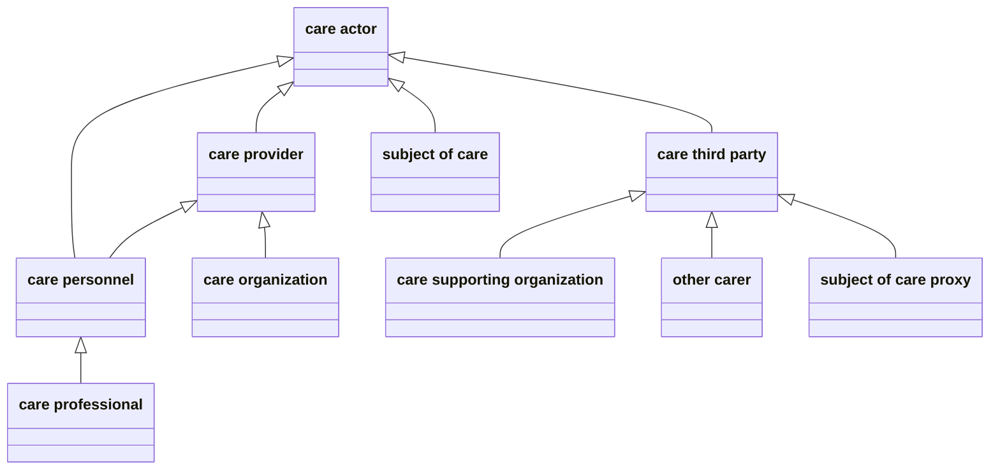
## care contact
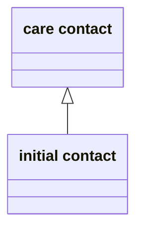
## care plan
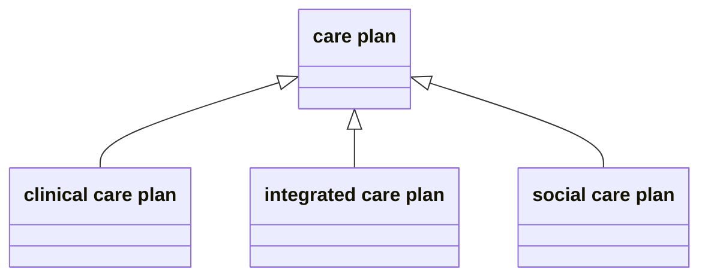
## care process
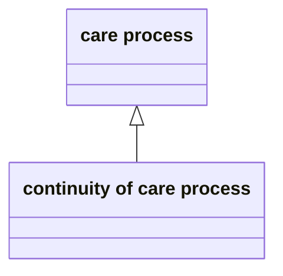
## data
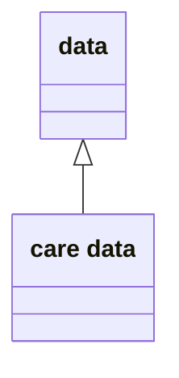
## event
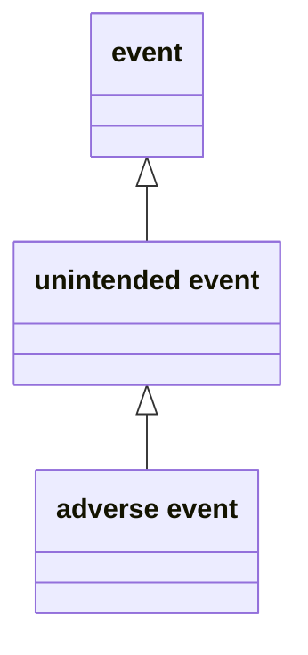
## health condition
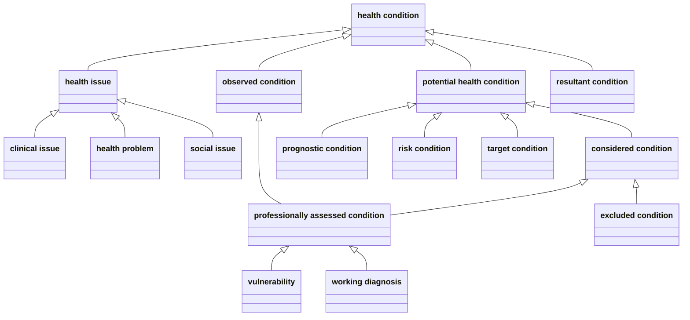
## health condition period
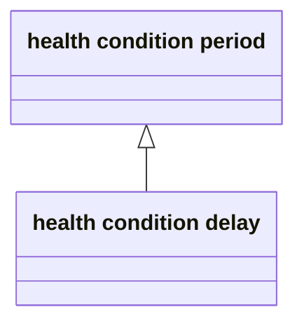
## health need
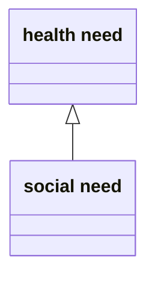
## health record extract
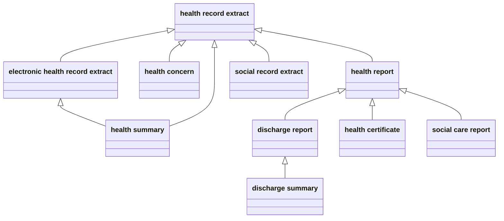
## health related period
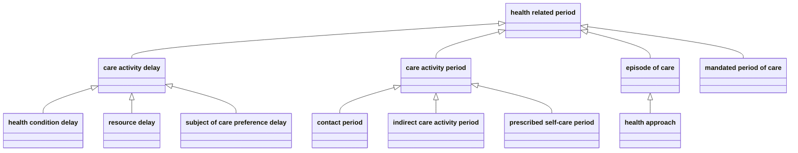
## health state
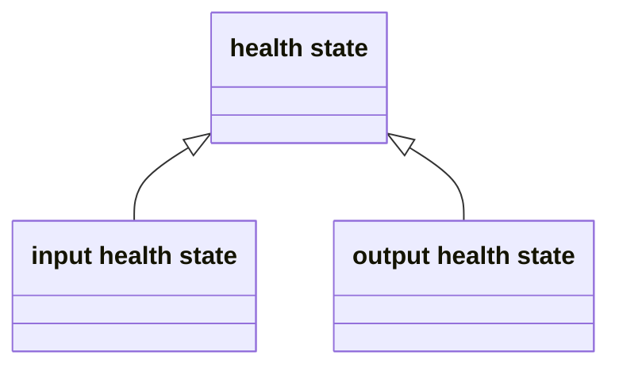
## health thread
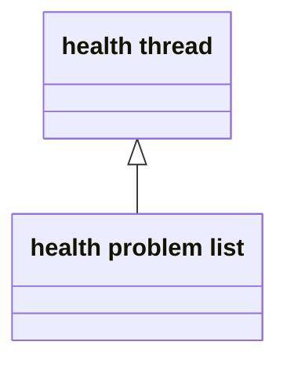
## information
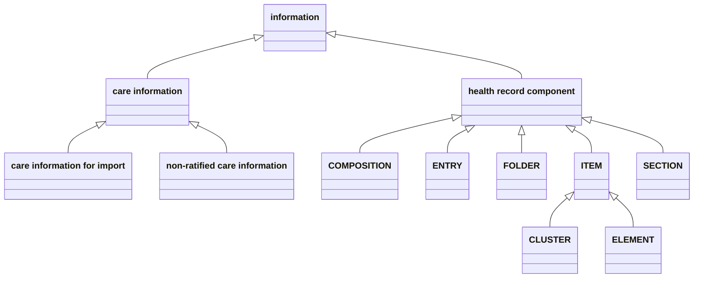
## knowledge
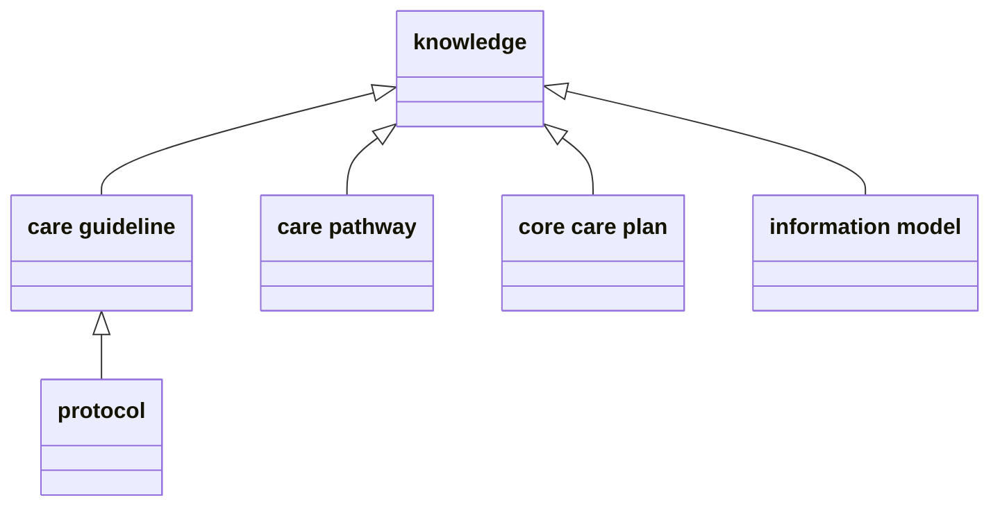
## mandate
```mermaid
classDiagram
    direction BT
    class d9484351-8f6a-4cab-ad92-b844eee8ccd2 ["mandate"]
    
    class 820f67b6-f718-4c09-a097-6d16be2a5b16 ["care employment"]
    
    class d124a289-7465-4e25-8672-fec02119fb9d ["care mandate"]
    
    class bd9ee1b7-b197-4027-92eb-8294df1bd262 ["care activity mandate"]
    
    class 1b6e3a68-57fe-452b-918b-041a204b3399 ["care period mandate"]
    
    class 8b81cc8c-acce-4ef1-942e-81583c336afc ["continuity facilitator mandate"]
    
    class 89f28968-af6f-41e4-b5f4-9f375d03a9ba ["mandate to export personal information"]
    
    class b8aa75c1-a052-4ad9-a844-315adfd47363 ["request mandate"]
    
    class ab80dbac-8522-45f7-853a-7905bd1c91d4 ["care professional entitlement"]
    
    class 7c83aba3-84cb-41ac-8245-e2e0734471fb ["clinical care activity mandate"]
    
    class 0aa436bf-12ec-4611-afad-78dfde13d17f ["proxy mandate"]
    
    class 100cc991-af33-442d-8d4a-589418a23ede ["social care activity mandate"]
    
    class 86fec362-02dc-4b26-85f3-e1c3243c1c09 ["subject of care proxy"]
    
    bd9ee1b7-b197-4027-92eb-8294df1bd262 --|> d124a289-7465-4e25-8672-fec02119fb9d
    820f67b6-f718-4c09-a097-6d16be2a5b16 --|> d9484351-8f6a-4cab-ad92-b844eee8ccd2
    d124a289-7465-4e25-8672-fec02119fb9d --|> d9484351-8f6a-4cab-ad92-b844eee8ccd2
    1b6e3a68-57fe-452b-918b-041a204b3399 --|> d124a289-7465-4e25-8672-fec02119fb9d
    ab80dbac-8522-45f7-853a-7905bd1c91d4 --|> d9484351-8f6a-4cab-ad92-b844eee8ccd2
    7c83aba3-84cb-41ac-8245-e2e0734471fb --|> d9484351-8f6a-4cab-ad92-b844eee8ccd2
    8b81cc8c-acce-4ef1-942e-81583c336afc --|> d124a289-7465-4e25-8672-fec02119fb9d
    89f28968-af6f-41e4-b5f4-9f375d03a9ba --|> d124a289-7465-4e25-8672-fec02119fb9d
    0aa436bf-12ec-4611-afad-78dfde13d17f --|> d9484351-8f6a-4cab-ad92-b844eee8ccd2
    b8aa75c1-a052-4ad9-a844-315adfd47363 --|> d124a289-7465-4e25-8672-fec02119fb9d
    100cc991-af33-442d-8d4a-589418a23ede --|> d9484351-8f6a-4cab-ad92-b844eee8ccd2
    86fec362-02dc-4b26-85f3-e1c3243c1c09 --|> d9484351-8f6a-4cab-ad92-b844eee8ccd2

```
## request for care
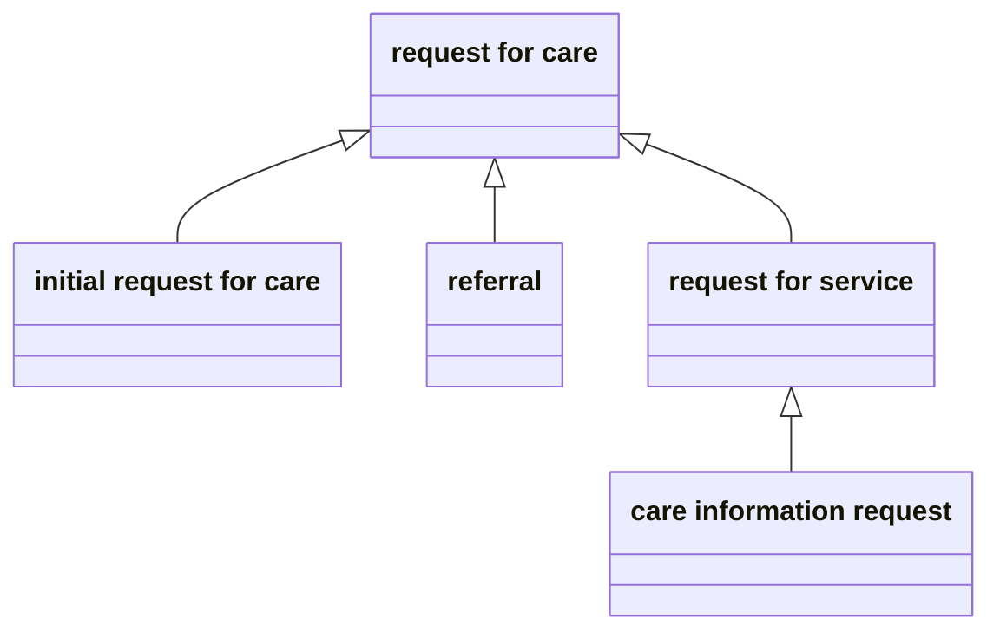
## resource
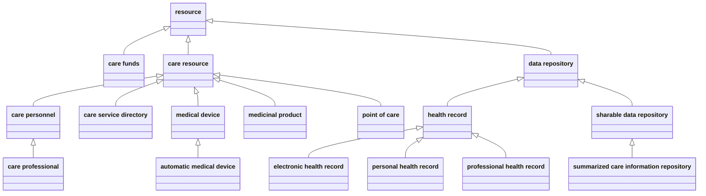
## role
```mermaid
classDiagram
    direction BT
    class faae5d89-dbed-4ce7-8312-cf44671ef8a9 ["role"]
    
    class f9f68904-81d6-4f42-9efe-41843fd1f3de ["organization role"]
    
    class 4b2f4ba0-8161-4732-a806-bbeaccb1661b ["person role"]
    
    class e1853a99-c0c0-4810-801a-e5f38238b077 ["care performer"]
    
    class 78071a9f-369a-4901-ac44-654558c9729e ["prescriber"]
    
    class 537621a0-e4e5-4bec-9b48-5542f9db43e5 ["other carer"]
    
    class 1454e668-dc11-43f0-97e7-2eae11bd40a2 ["self-care performer"]
    
    class a41a1596-fa3c-4c2b-aa3a-a69119a2a5de ["subject of care"]
    
    class 3e4137ce-d8f3-403b-bff2-78515aa7d6d0 ["third party care performer"]
    
    e1853a99-c0c0-4810-801a-e5f38238b077 --|> 4b2f4ba0-8161-4732-a806-bbeaccb1661b
    f9f68904-81d6-4f42-9efe-41843fd1f3de --|> faae5d89-dbed-4ce7-8312-cf44671ef8a9
    537621a0-e4e5-4bec-9b48-5542f9db43e5 --|> 4b2f4ba0-8161-4732-a806-bbeaccb1661b
    4b2f4ba0-8161-4732-a806-bbeaccb1661b --|> faae5d89-dbed-4ce7-8312-cf44671ef8a9
    78071a9f-369a-4901-ac44-654558c9729e --|> e1853a99-c0c0-4810-801a-e5f38238b077
    1454e668-dc11-43f0-97e7-2eae11bd40a2 --|> 4b2f4ba0-8161-4732-a806-bbeaccb1661b
    a41a1596-fa3c-4c2b-aa3a-a69119a2a5de --|> 4b2f4ba0-8161-4732-a806-bbeaccb1661b
    3e4137ce-d8f3-403b-bff2-78515aa7d6d0 --|> 4b2f4ba0-8161-4732-a806-bbeaccb1661b

```
## subject of care desire
```mermaid
classDiagram
    direction BT
    class 174db6b0-8561-4c33-a5f6-18d0eee999d2 ["subject of care desire"]
    
    class 92b51f00-0b80-4169-98e8-148e43bd9bdc ["objection"]
    
    92b51f00-0b80-4169-98e8-148e43bd9bdc --|> 174db6b0-8561-4c33-a5f6-18d0eee999d2

```
